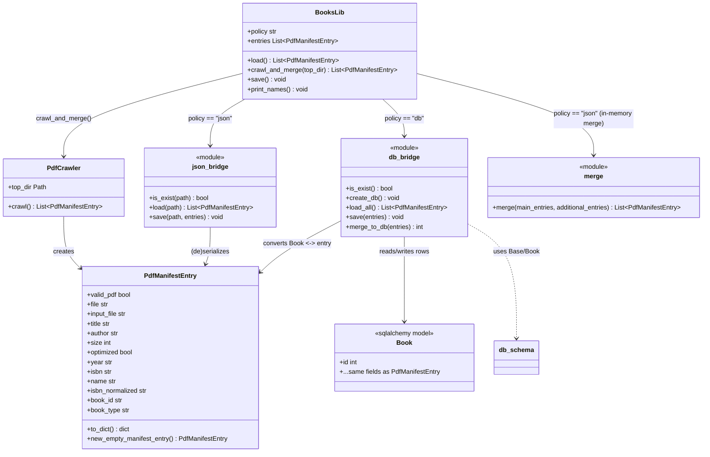
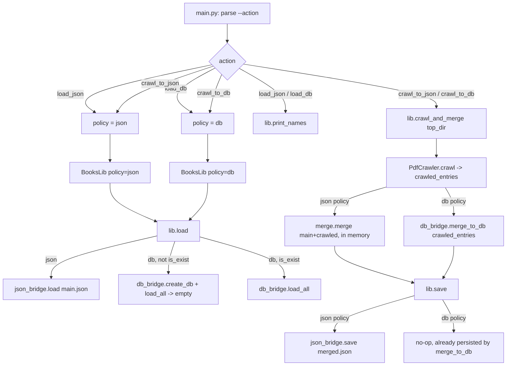

# PDF Manifest — Architecture

## Responsibilities

| File            | Responsibility                                                             |
|------------------|-----------------------------------------------------------------------------|
| `manifest.py`    | `PdfManifestEntry` dataclass — the record shape. No I/O.                   |
| `crawl.py`       | `PdfCrawler` — walks a directory tree, returns `List[PdfManifestEntry]`.   |
| `json_bridge.py` | Only module that reads/writes the JSON manifest files.                    |
| `db_bridge.py`   | Only module that talks to `books_db.sqlite` (via `db_schema.py`).         |
| `db_schema.py`   | SQLAlchemy `Book` table definition.                                       |
| `merge.py`       | Pure in-memory merge: add-only-new-by-`name`. Used for the json policy.   |
| `books_lib.py`   | `BooksLib` — holds the entry list, picks json_bridge vs db_bridge by policy. |
| `main.py`        | CLI (click) — reads `--action`, builds `BooksLib` with the right policy, calls `load` / `crawl_and_merge` / `save` / `print_names`. |

Rule: **only `json_bridge.py` and `db_bridge.py` touch storage.**
`books_lib.py` and `main.py` never open a file or a DB connection directly.

## Class diagram

## Flow — `main.py --action <...>`

## Actions summary

- **load_json** — read `main.json`, print names.
- **load_db** — open/create `books_db.sqlite`, print names.
- **crawl_to_json** — load `main.json`, crawl `--top-dir`, merge in memory (unique by `name`), write `merged.json`.
- **crawl_to_db** — if `books_db.sqlite` doesn't exist: create it and seed from `main.json`; then crawl `--top-dir` and merge new entries (unique by `name`) directly into the DB.
