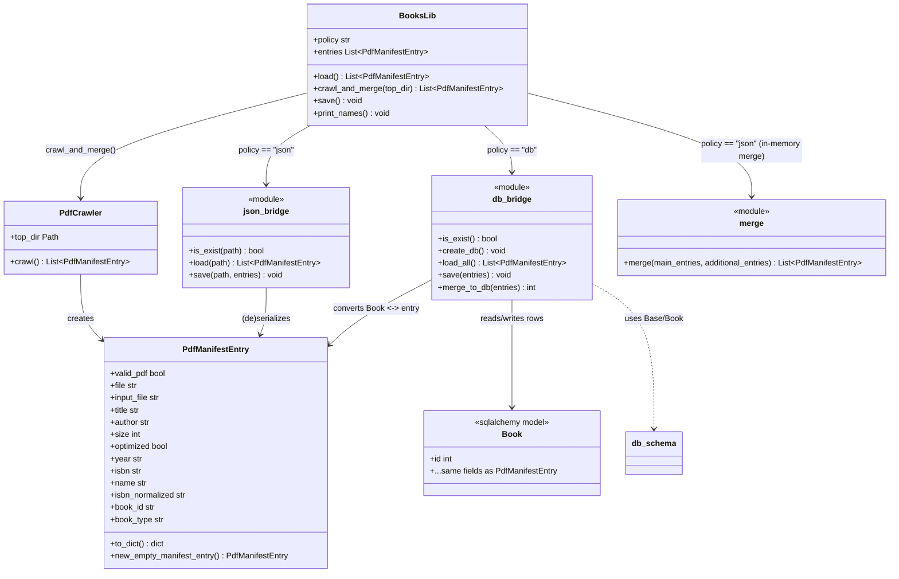
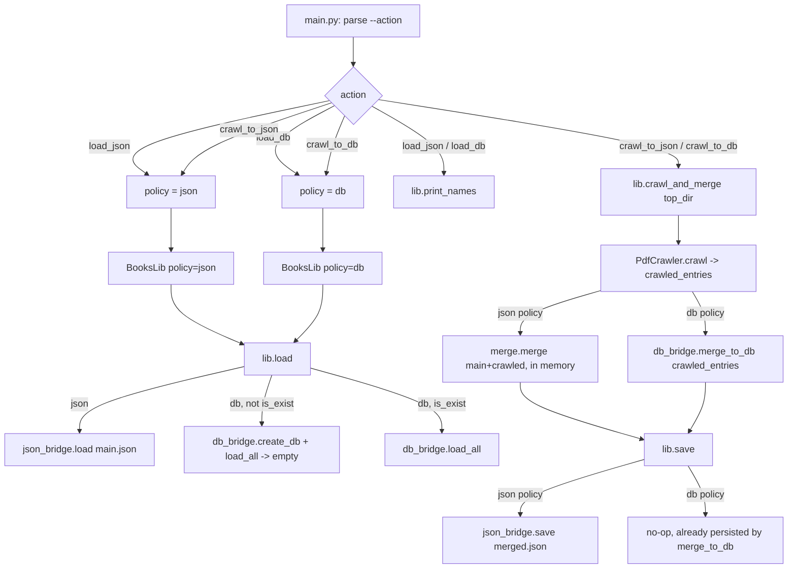

# PDF Manifest — Architecture

## Project layout

```
pdfmanifest/
├── pytest.ini        # testpaths=tests, pythonpath=src
├── run_tests.sh       # ./run_tests.sh [pytest args]
├── run_app.sh          # ./run_app.sh --action ... (wraps src/main.py)
├── src/                # all implementation
├── tests/              # all tests (mirrors src/ modules)
├── doc/                 # this file
└── samples/              # dummy PDFs for manual testing / demos
```

## Responsibilities (all under `src/pdfmanifest/`)

| File            | Responsibility                                                             |
|------------------|-----------------------------------------------------------------------------|
| `manifest.py`    | `PdfManifestEntry` dataclass — the record shape. No I/O.                   |
| `crawl.py`       | `PdfCrawler` — walks a directory tree, returns `List[PdfManifestEntry]`.   |
| `json_bridge.py` | Only module that reads/writes the JSON manifest files.                    |
| `yaml_bridge.py` | Only module that reads/writes the 2-document books YAML file.             |
| `yaml_schema.py` | Schema/field-mapping for the YAML documents (used only by `yaml_bridge.py`). |
| `db_bridge.py`   | Only module that talks to `books_db.sqlite` (via `db_schema.py`).         |
| `db_schema.py`   | SQLAlchemy `Book` table definition.                                       |
| `merge.py`       | Pure in-memory merge: add-only-new-by-`name`. Used for the json/yaml policies. |
| `books_lib.py`   | `BooksLib` — holds the entry list, picks json/yaml/db bridge by policy.   |
| `main.py`        | CLI (click) — `--tui yes/no` switch; classic one-shot mode reads `--action`, builds `BooksLib`, calls `load`/`crawl_and_merge`/`save`/`print_names`. |
| `tui.py`         | Interactive ncurses TUI (`--tui=yes`, the default). See "TUI" below.      |

Rule: **only `json_bridge.py`, `yaml_bridge.py`, and `db_bridge.py` touch storage.**
`books_lib.py`, `main.py`, and `tui.py` never open a file or a DB connection directly —
they all go through `BooksLib`.

## Class diagram



## Flow — `main.py --action <...>`



## Policies

`BooksLib(policy=...)` is `"json"`, `"yaml"`, or `"db"`. Only `json_bridge.py`,
`yaml_bridge.py`, and `db_bridge.py` are allowed to touch storage directly.

## Actions summary (`main.py --action ...`)

- **load_json** — read `main.json`, print names.
- **load_yaml** — read `main.yaml` (2-document format), print names.
- **load_db** — open/create `books_db.sqlite`, print names.
- **crawl_to_json** — load `main.json`, crawl `--top-dir`, merge in memory (unique by `name`), write `merged.json`.
- **crawl_to_yaml** — load `main.yaml`, crawl `--top-dir`, merge in memory (unique by `name`), write `saved.yaml` (header `input_path` defaults to `--top-dir`, override with `--yaml-input-path`).
- **crawl_to_db** — if `books_db.sqlite` doesn't exist: create it and seed from `main.json`; then crawl `--top-dir` and merge new entries (unique by `name`) directly into the DB.

## TUI

`python -m pdfmanifest.main` (i.e. `--tui=yes`, the default) launches an
interactive ncurses menu instead of the one-shot CLI:

- **Main menu**: Load, Crawl & Merge, Save, Show entries, Settings, Quit.
- **Settings** edits the same parameters the CLI takes as flags: policy
  (json/yaml/db), top-dir, and the json/yaml paths.
- A single `TuiSession` (in `tui.py`) holds the current policy, paths, and
  the `BooksLib` instance for the whole run. Actions read and mutate that
  one session — nothing is torn down or reset between actions — so the
  in-memory entry list survives repeated Load / Crawl & Merge / Save calls
  in the same session (e.g. crawling two different directories in a row
  accumulates entries instead of starting over each time).
- `q` / Esc backs out of a submenu; **Quit** on the main menu (or `q` /
  Esc there) exits the program.

`--tui=no` runs the classic one-shot CLI exactly as before (`--action ...`),
unchanged.
